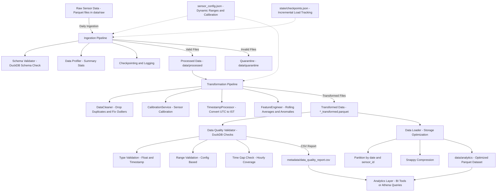

# Agricultural Sensor Data Pipeline — End-to-End Documentation

## Overview:

This project implements a modular, production-grade data processing pipeline for an agricultural monitoring system.
Sensors placed across farmlands collect data such as temperature, humidity, soil moisture, light intensity, and battery levels.

The pipeline processes this data through four major stages:

* Data Ingestion — reads raw Parquet files, validates schema & logs stats

* Data Transformation — cleans, calibrates, and enriches data

* Data Quality Validation — verifies post-transform integrity using DuckDB

* Data Loading & Storage — optimizes for analytics with Parquet partitioning and compression

All stages are fully modular, easily orchestrated (via Airflow/DAG), and production-ready (incremental load, DuckDB validation, config-driven design).

## Folder structure:


## High-Level Design (HLD)


## 🌾 End-to-End Pipeline Flow

This agricultural IoT data pipeline processes **daily sensor data from farmlands** — covering **Ingestion**, **Transformation**, **Validation**, and **Optimized Storage** for analytics.

---

### 🟢 1️⃣ Data Ingestion

**Input:** Parquet sensor files dropped into `data/raw/` (e.g., `2025-06-05.parquet`)

**Example schema:**

| sensor_id | timestamp | reading_type | value | battery_level |
|------------|------------|---------------|--------|----------------|
| sensor_1 | 2025-06-05T10:00:00 | temperature | 26.5 | 90.0 |

**Steps:**

1. **File Discovery** – `FileScanner` identifies new raw files not yet processed using `state/checkpoints.json`.
2. **Schema Validation** – `SchemaValidator` (DuckDB) ensures all required columns exist.  
   - Missing or corrupt files are moved to **`data/quarantine/`**.
3. **Profiling** – `DataProfiler` uses DuckDB to generate summaries:
   - Record counts  
   - Average, min, max values  
   - Battery statistics per `reading_type`
4. **Data Reading** – Efficiently loads files using DuckDB into Pandas DataFrames.
5. **Logging** – `IngestionLogger` updates checkpoints and ingestion logs in `state/checkpoints.json`.

**Outputs:**

- ✅ Valid data → `data/processed/*_processed.parquet`  
- ⚠️ Invalid/corrupt data → `data/quarantine/`

---

### 🔵 2️⃣ Data Transformation

**Goal:** Clean, normalize, and enrich sensor data for analytical use.

**Components:**

1. **`DataCleaner`**
   - Drops duplicates.
   - Fills missing numeric values.
   - Detects & corrects outliers using **z-score** and safe ranges from `config/sensor_config.json`.

2. **`CalibrationService`**
   - Applies per-sensor calibration:  
     ```
     value = raw_value * multiplier + offset
     ```
   - Uses calibration values from `config/sensor_config.json`.

3. **`TimestampProcessor`**
   - Converts timestamps to **ISO 8601** format.
   - Adjusts timestamps to **UTC+5:30 (IST)**.

4. **`FeatureEngineer`**
   - Adds analytical fields:
     - `daily_avg` → mean per sensor/day/reading_type  
     - `rolling_7d_avg` → rolling 7-day mean  
     - `anomalous_reading` → boolean flag for values outside expected range.

**Outputs:**

- ✅ Transformed files → `data/processed/*_transformed.parquet`

---

### 🟣 3️⃣ Data Quality Validation (DuckDB)

**Purpose:** Acts as a **quality gate** ensuring transformed data meets accuracy and consistency standards.

**Engine:** `DataQualityValidator` using DuckDB SQL queries.

**Validations Performed:**

| Validation Type | Description |
|------------------|-------------|
| **Type Validation** | Checks that `value` is a numeric DOUBLE and `timestamp` is valid TIMESTAMP. |
| **Range Validation** | Ensures values fall within expected sensor-specific ranges. |
| **Missing Values %** | Calculates percentage of missing readings per `reading_type`. |
| **Time Coverage Gaps** | Detects missing hourly readings per sensor using `generate_series()` logic. |
| **Aggregated Summary** | Compiles all results into a unified quality report CSV. |

**Output:**

- ✅ `metadata/data_quality_report.csv`

**Example Report:**

| file_name | total_records | invalid_value_type | invalid_timestamp | outlier_% | missing_% | total_missing_hours |
|------------|----------------|--------------------|------------------|------------|-------------|---------------------|
| 2025-06-05_transformed.parquet | 1200 | 0 | 0 | {"temperature":0} | {"humidity":0.5} | 3 |

---

### 🟠 4️⃣ Data Loading & Storage Optimization

**Goal:** Store clean, transformed data in a query-optimized format for analytics tools.

**Component:** `DataLoader`

**Steps:**

1. Reads all transformed Parquet files.
2. Parses timestamp column and extracts `date`.
3. Adds partition columns (`date`, `sensor_id`).
4. Writes to `data/analytics/` using **columnar Parquet format** with **Snappy compression**.
5. Optimizes for analytical engines (DuckDB, Spark, Athena).

**Output Directory Structure:**
```
data/analytics/
├── date=2025-06-05/
│ ├── sensor_id=sensor_1/
│ │ ├── part-0.parquet
│ │ ├── part-1.parquet
```

---

### ⚙️ 5️⃣ Configuration & Metadata Management

| File | Purpose |
|------|----------|
| `config/sensor_config.json` | Defines thresholds and calibration parameters for each sensor type. |
| `state/checkpoints.json` | Tracks ingested files for incremental loading. |
| `metadata/data_quality_report.csv` | Stores the results of all data validation checks. |

**Example: `sensor_config.json`**

```json
{
  "temperature": { "min": 0, "max": 50, "calibration": { "multiplier": 1.02, "offset": 0.5 } },
  "humidity": { "min": 0, "max": 100, "calibration": { "multiplier": 0.98, "offset": 0.3 } },
  "soil_moisture": { "min": 0, "max": 80, "calibration": { "multiplier": 1.01, "offset": 0.1 } },
  "light_intensity": { "min": 0, "max": 1200, "calibration": { "multiplier": 1.00, "offset": 0.0 } },
  "ph_level": { "min": 0, "max": 14, "calibration": { "multiplier": 1.00, "offset": 0.0 } }
}

